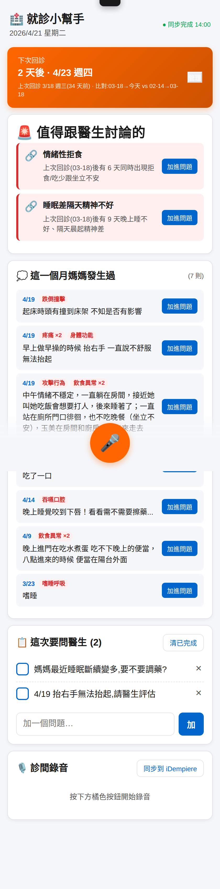
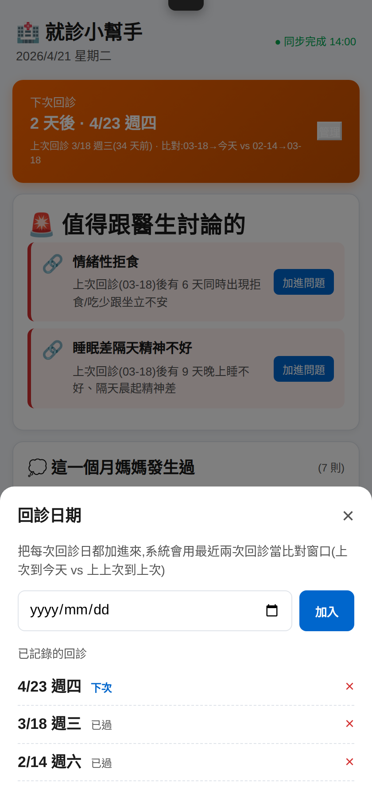

# Dementia Care Tools

一位很 I 的軟體工程師做的一組工具。**上位 mission**:「**讓整個家忙起來**」—— 用工具、植物、寵物、結構化紀錄,讓家裡每天有事在發生、有生命陪伴。

- **主線**:失智照護生態系(4 個工具互相串聯成資料閉環)
- **支線 A**:為 2023 年出生女兒做的學習平台
- **支線 B**:原本自己挑奶粉用、後來擴展到失智媽媽醫療營養品跟藥師朋友共用的成分比較網站
- **支線 C**:家庭園藝 + 寵物手冊(2026-04 起步)—— **可食/觀葉植物讓長輩每天有事做、寵物提供情感陪伴**,呼應主線的 mission

純前端、單一 HTML 檔為主、零伺服器、零廣告、零追蹤、完全離線可用。
想做什麼就做什麼,用最純粹的技術,讓每個家庭都能免費使用。

---

## 工具列表

### 🧠 失智照護生態系

| 工具 | 對象 | 類型 | 說明 |
|------|------|------|------|
| [陪伴小幫手（原版）](./dementia-companion/) | 失智症長輩 + 照護者 | 互動遊戲 | 15 個遊戲（13 認知訓練 + 2 舒緩工具 + 常駐「每日問候」），8 級難度滑桿自動選 10 個顯示 |
| [陪伴小幫手 v2（試驗版）](./dementia-companion-v2/) | 失智症長輩 + 照護者 | 互動遊戲 | v1 同款遊戲，新設計：推薦式首頁 + 照護者陪伴指南 + 今日摘要分享 |
| [白板 OCR 紀錄 Bot](./whiteboard-ocr-bot/) | 家屬 + iDempiere | Telegram Bot | 每日照片 → Gemini 3 OCR → 自動寫入 iDempiere，每月回診給醫生看 |
| [就診小幫手](./mom-clinic-companion/) | 照護者 | 手機 Web App | 回診前 prep 工具：拉 iDempiere 紀錄、自動抓異常、症狀分類、診間錄音 |

### 🏠 其他家用工具

| 工具 | 對象 | 類型 | 說明 |
|------|------|------|------|
| [健康飲品成分分析](./health-drinks/) | Tom 自家 + 藥師朋友 + 他的客戶 | 網站 | 起源是挑奶粉，現在涵蓋嬰幼兒配方 + 醫療營養品 + 高蛋白等 |
| [小朋友學習樂園](./kids-companion/) | 2–6 歲幼兒 + 家長 | 互動遊戲 | 25+ 種寓教於樂的學習活動 |
| [家庭園藝手冊](./garden-handbook/) | 新手 + 失智照護者 + 爸媽 | 單檔 Web App | **25 種植物 × 6 類別**，10-section 完整 SOP + 🎯 5W1H 總覽 + 🎯 規劃模式 + 🛒 購物籃匯入 + 📅 24 節氣系統 + 🧠 失智照護 3 級連動 |
| [家中寵物手冊](./pet-handbook/) | 有寵物的家庭 + 失智照護者 | 單檔 Web App | 物種分類架構(貓/狗/兔/鳥/魚/烏龜)，**目前貓 6 個 topics**(Tom 養貓實戰筆記)，其他物種待擴充。通用頁含**失智照護 × 寵物選擇指南 matrix** |

---

## 為什麼做這個

### 陪伴小幫手（原版）

陪伴失智家人時，想話題、找互動方式來促進腦部活動，對一個內向的人來說相當消耗腦力。所以做了這個工具——打開就能用，不用想話題，遊戲自動引導互動。希望幫助所有同樣辛苦的照護者。

### 陪伴小幫手 v2

v1 每天實際使用後，發現「10 格遊戲自己挑」的首頁其實又把決策成本丟回給已經很累的照護者。v2 換一個方向：首頁直接「今天一起做這個好嗎？」推薦一個活動，一鍵開始。同時多做兩個照護者支援功能——**45 條陪伴指南**（每個遊戲 3 條可直接對長輩說的話）跟**今日摘要分享**（完成活動後一鍵產出可貼 LINE 家族群的今日紀錄）。v1 並存沒被取代，可以對照比較。

### 白板 OCR 紀錄 Bot

每天拍一張白板照片傳給 Telegram bot，Gemini 3 Flash Preview 自動把磁鐵位置轉成結構化資料寫進 iDempiere。每月回診時直接打開 iDempiere 給醫生看趨勢。設計理念是 **human-as-verifier**：OCR 不完美沒關係，家屬每天就是那個最終檢查者。

### 就診小幫手

有了 iDempiere 的每日紀錄，還缺一個「帶媽媽去回診時用的手機工具」。這個 APP 不是資料查詢（平板上的 iDempiere UI 已經做這件事），是**回診前的 prep 工具**——幫照護者記憶、發現趨勢、準備要跟醫生討論的話題。

**關鍵設計**：
- **回診倒數** + 上次回診多久前
- **自動對比窗口**：用你登記的最近兩次回診當邊界（上次到今天 vs 上上次到上次），不是傻傻的「近 14 天」
- **趨勢異常偵測**：對 5 欄位（睡眠／精神／陪伴／活動／排泄）算 recent vs baseline 的「不好值」比例差
- **跨欄位同日組合**：失智照顧常見 pattern 例如「拒食+情緒不穩 = 情緒性拒食」、「睡差+隔天精神差」
- **連續天數 streak**：連續 4+ 天同一異常
- **症狀關鍵字分類**（13 群 regex pattern + 排除詞）從 Description 抓事件——解決「打」抓到「打招呼」的誤判
- **長期問題**偵測：不是變差，是一直不好
- **問題清單**：每一項異常都能一鍵「加進要問醫生的清單」
- **診間錄音**：Web Speech API 即時轉文字，回家同步回 iDempiere

**架構**：單一 HTML，純 JS + iDempiere REST API。前端自動偵測 localhost vs production。後端需 CORS filter（見 [CORS-MIGRATION.md](./mom-clinic-companion/CORS-MIGRATION.md)）。

<table>
<tr>
<td valign="top"><b>主畫面</b><br>
自動從 iDempiere 拉近 3 個月紀錄，用最近兩次回診當對比窗口算出變化，
關鍵字分類顯示症狀事件。<br><br>

</td>
<td valign="top"><b>回診清單管理</b><br>
每次回診完記一下，下次自動拿這兩次當比對邊界。<br><br>

</td>
</tr>
</table>

### 小朋友學習樂園

為了 2023 年出生的女兒，想做一個跟她互動的遊戲。不想裝 app、不想看廣告、不想傳資料到外面。一個 HTML 檔，開了就能玩。

**內容規模**:
- **5 個分類 tab**:📚 語言 / 🎨 創作 / 🧠 思維 / 📖 故事 / 🔍 探索
- **25+ 種活動**,其中探索類含 **120 種動物圖鑑 + 110 種天然食材** + 數學樂園 / 餐盤設計 / 場景佈置 / 故事拼組等
- **4 年齡層**(幼幼 2-3 / 小班 3-4 / 中班 4-5 / 大班 5-6),選項數、語音輔助、字體大小全自動配合

**遊戲化設計**:集星星(集滿 5 顆全屏慶祝)、貼紙書、連續天數、神秘寶箱(當天完成 3+ 解鎖)、搖一搖跳驚喜活動。

**隱私設計極保守**:不連 CDN、不連 Google Fonts、字型用系統內建。桌面 Chrome / Edge 的 Web Speech API 會送雲端這點有明文警告(設定頁可關閉聲音)。

### 家庭園藝手冊

呼應 repo 上位 mission「**讓整個家忙起來**」—— 用植物讓家裡有生長中的東西、需要每天互動的動作、可以採來吃或觀賞的成果。對有失智長輩的家庭,種植是 behavior redirection 的有效工具(詳見 Tom 的 blog「失智照顧半年的三個誤會」系列)。

**兩層策略**:
- **High-maintenance 植物**(地瓜葉、香草、果菜類)→ 讓長輩**天天有事做**
- **Low-maintenance 植物**(虎尾蘭、多肉、黃金葛類)→ 給**照顧者的喘息後援**(累到不想顧時還是有綠意)

手冊把這個策略系統化:**25 種植物 × 6 類別**,每個 plant 統一 10-section 結構(why / obtain / pot-soil / steps / 完整時程表 / 施肥 SOP / 採收 / 失敗點 / **失智照護 byLevel** / 實測紀錄)。

**核心功能**:
- 🎯 **5 秒總覽(5W1H)** — 每個 plant 頁頂自動抽 6 行摘要(Who / What / When / Where / Why / How)+ 適合情境 tag badges(新手友善、小空間、兒童可參與、寵物勿食等)
- 🎯 **規劃模式**(全域設定) — 只看「現在 + 未來 2 個月能下手 + 我的最愛」,月份過了自動進出
- 🛒 **購物籃** — 多個 plants 加進來自動合併成**依來源分組**的採購清單(培養土加總 · 肥料共用 · 工具 dedup + 基本工具組 + 建議流程 Day 0~30+),匯出純文字可貼 LINE
- 📅 **24 節氣系統** — 比月曆更準的種植指南(清明開工、立冬停工),每個 plant 的時機警告用「月份 × 節氣雙軌」
- 🌾 **施肥 SOP** — 預設固體緩釋肥(好康多 1 號 NPK 14-11-13),用量公式「盆邊每 10 cm = 3 粒」
- 🧠 **失智照護 byLevel** — 輕度(自主)/ 中度(單步引導)/ 重度(感官陪伴) 依設定頁切換

**哲學**:照護者沒時間觀察植物,所以時程寫成 SOP 日期表(記憶外包到 Google 行事曆),失敗/禁忌條件放顯眼處(例:「冬天扦插地瓜葉會死」放第一眼,不藏在附註)。目前地瓜葉是 Tom 家實測中(Day 8 兩盆全活),其他多數由可信來源整理,歡迎 fork 補實測。

### 家中寵物手冊

**定位**:寵物跟植物不一樣 —— 他會**主動靠近**你、讓你感受到**被需要**、他是**家人**,不只是被照顧的對象。對失智長輩尤其重要 —— 當她大腦退化、溝通困難,一個會自己跳上她腿、用頭頂她手的生命,是「她還被需要、她還存在」的證明。

跟 garden-handbook 平行,但更深一層 —— 植物讓家忙,寵物讓家**有另一個主動的家庭成員**。

**按物種分類**:
- 🐱 **貓**(目前 6 個 topics,來自 Tom 累積多年的養貓 HackMD 筆記)
- 🐶 狗 / 🐰 兔 / 🐦 鳥 / 🐠 魚 / 🐢 烏龜(架構已建,**內容待擴充**,歡迎 Fork 補上)

**貓現有 topics**:
- 🤝 親訓新貓(4 階段 SOP)
- 👥 多貓介紹(15 步驟)
- 🍲 飼料挑選(看成分 5 步驟 + 品牌清單)
- 🌾 貓草種植(土耕 vs 水耕實測)
- 💉 疫苗接種時程
- ❄️ 冬天保暖

**通用知識頁的核心**:❤ **失智照護 × 寵物選擇指南** —— 不同物種在失智照護 context 的適配度 matrix、選擇原則(輕度/中度/重度)、已有寵物時的家庭應對(例:大型犬每天要長時間運動,中度失智後長輩體力跟不上)。這個判斷是 handbook 給照顧者的**價值核心** —— 避免養到一半放棄或傷害動物。

### 健康飲品成分分析

**起源與演化**：

1. **🍼 為女兒挑奶粉**（起源）——各品牌蛋白質/鐵/DHA 排法不一肉眼比不出來
2. **🍼 小孩奶粉本身就要細比**（深化）——**1 歲 vs 3 歲配方差異大**，加上**小安素（亞培 PediaSure）這類特殊性兒童配方**要馬上認真比對
3. **💊 藥師朋友點醒老人端**（擴展）——他自己有客戶同樣需求（醫療營養品：安素、葡勝納、倍速益、補體素、倍力素），跟 Tom 講了之後 Tom 才意識到**這工具也能用在家裡的失智媽媽身上**（自己照顧媽媽卻沒自動聯想到的盲點）
4. 現在三重使用者：Tom 自家（女兒+媽媽）+ 藥師朋友 + 他的藥局客戶。`drinks.js` 裡**小安素歸類在「醫療營養品」**是橋接起源跟擴展的橋樑產品

真正兩個痛點：
1. **各品牌成分表排序、單位不統一**——有的先蛋白質、有的先熱量、單位 mg/mcg/per 份/per 100ml 混用。使用者原話：**「客戶有時候需求來我們比對來不及」**。櫃檯前要當場比對時，肉眼掃超容易漏行
2. **OCR 實務不可行**——賣家放 100 張商品圖可能只有 10 張真的是成分表，剩下是行銷圖、情境照。營養標示字小又常印在曲面上。所以務實做法是**親自到家樂福/大樹拍包裝**，用 Claude/Gemini 辨識成結構化 JSON

**資料流程**：拍包裝 → AI 擷取 → 手填 `drinks.js` → GitHub Pages 自動部署。比較矩陣左欄**動態生成**——某筆有填碘，那一列才出現。全欄位填含微量元素（brain file 明訂）。粉狀產品的 `volume_ml` 是沖調後體積，前端依此換算 per 100ml。

---

## 技術特色

所有工具共用的哲學——**最純粹的技術，最低的門檻**：

- **前端工具用單一 HTML 檔**：`dementia-companion`、`dementia-companion-v2`、`kids-companion` 雙擊就能開，不用 npm、不用 build、不用伺服器
- **零追蹤、零廣告**：進度都存瀏覽器 localStorage，不送資料到外部分析服務
- **語音用瀏覽器內建**：Web Speech API，不依賴雲端 TTS
- **離線優先**：即使需要 API 的 `mom-clinic-companion`，也會 cache 最後同步版本給診間弱網使用
- **Python 後端只在真的需要時才用**：`whiteboard-ocr-bot` 走 Telegram + Gemini API，`health-drinks` 用 scraper 產靜態資料

---

## 各工具安裝 / 使用

每個 subdirectory 都有自己的 `README.md` 寫快速開始。摘要如下：

| 工具 | 怎麼用 |
|------|-------|
| [陪伴小幫手（原版）](./dementia-companion/) | 直接 `open dementia-companion/index.html` |
| [陪伴小幫手 v2](./dementia-companion-v2/) | 直接 `open dementia-companion-v2/index.html`（跟 v1 可以並用） |
| [小朋友學習樂園](./kids-companion/) | 直接 `open kids-companion/index.html` |
| [家庭園藝手冊](./garden-handbook/) | 直接 `open garden-handbook/index.html` 或上線版 `tm731531.github.io/dementia-care/garden-handbook/` |
| [家中寵物手冊](./pet-handbook/) | 直接 `open pet-handbook/index.html` 或上線版 `tm731531.github.io/dementia-care/pet-handbook/` |
| [白板 OCR 紀錄 Bot](./whiteboard-ocr-bot/) | 先試玩 demo（`open index.html`）；正式版需 Python + Gemini API key |
| [就診小幫手](./mom-clinic-companion/) | 部署到 GitHub Pages，需 iDempiere 開 CORS（見 [CORS-MIGRATION.md](./mom-clinic-companion/CORS-MIGRATION.md)） |
| [健康飲品成分分析](./health-drinks/) | 跑 scraper 產資料，或用已上線 GitHub Pages 版本 |

或用本機伺服器一次跑所有純前端工具：

```bash
python3 -m http.server 8000
# 開 http://localhost:8000
```

---

## 支持這個專案

如果這些工具對你有幫助，歡迎請我喝杯咖啡：

**銀行轉帳 Bank Transfer (Taiwan):**
- 中國信託 CTBC Bank（822）
- 帳號 Account：204530014618

---

## 作者

**Tom Ting** — [blog.tomting.com](https://blog.tomting.com/)
